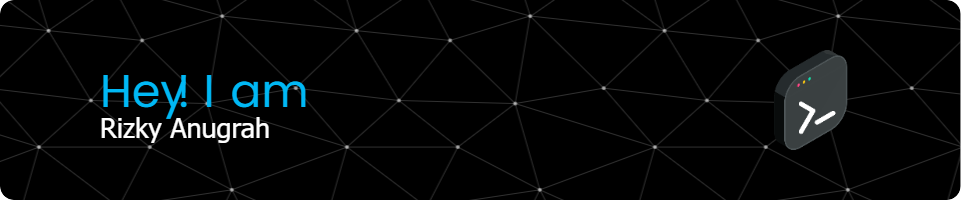

<h1 align="left">Hey 👋 What's up?</h1>

###

My name is Rizky and I'm from Medan

###

<h2 align="left">About me</h2>

###

✨ Hanya seorang member IMPHNEN

###

<h2 align="left">I code with</h2>

###

###

<h2 align="left">Socials</h2>

###

  

###

<picture>
  <source media="(prefers-color-scheme: dark)" srcset="https://raw.githubusercontent.com/Asterix-CHAN/Asterix-CHAN/output/pacman-contribution-graph-dark.svg">
  <source media="(prefers-color-scheme: light)" srcset="https://raw.githubusercontent.com/Asterix-CHAN/Asterix-CHAN/output/pacman-contribution-graph.svg">
  
</picture>

###

###

